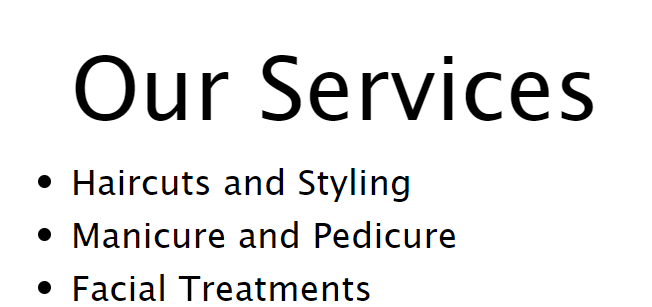
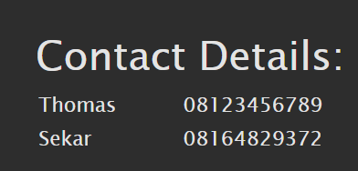
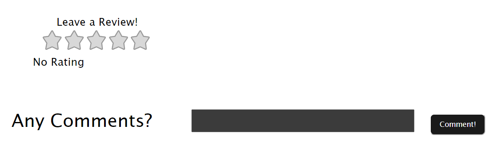

<h1> SEA SALON </h1>

Made by Wesley Frederick Oh 
Currently enrolling in University of Indonesia in Computer Engineering 2023. 

This project is made as a submission for Compfest Software Engineering Academy 2024.

# Disclaimer
You might need to install some dependencies as this project in running with Vite + Vue + TypeScript

Prequisites:
- Node.js, refer to: https://nodejs.org/en
- NPM (comes with Node.js)
- Git (optional), to clone things from GitHub to a local device, or you can just download all files directly from GitHub.

Setup:
- Download files or clone this repository
- Open terminal inside the root folder
- Start the development server in localhost by running "npm run dev" (without double quotes)

Due to some technical difficulties and limitation, this project does not support back-end (yet). As result, this project can be deployed on vercel.

<h3><a href="https://databases-peach.vercel.app/">Click Here for deployed website (front end only)</a></h3>
  
 

# Features
## Homepage (Level 1)
This website includes a homepage that consists of: 
<ul>
<li>Name</li>
<li>Slogan</li>
<li>Services</li>
<li>Contact Details</li>
</ul>

Screenshots: 
 
 
 

## Interactivity (Level 2)
Star Rating is available through the usage of vue-star-rating 
Credit: https://www.npmjs.com/package/vue-star-rating

Screenshots: 
 

Keep in mind that the stars stays in the latest rating after clicking. Example: 
 

As stated in level 2, the comment and rating is not yet in sync with database due to lack of implementation of databases for now. Thus making the review disappear once the page is refreshed.

## Reservation System (Level 3) [In Development]
Warning: The reservation system in this project is still in beta and sometimes crashes when submitting reservation form.

Dependencies used: <b>MySQL, XAMPP, PHP</b> 
Although still not integrated to MySQL as the database of choice, `process_form.php` exists within `./src/components/process_form.php`. This file might be used in the future to sync form data to MySQL.

## Authentication System (Level 4) [Not Implemented]
## Advanced Reservation System (Level 5) [Not Implemented]

Time is running out...